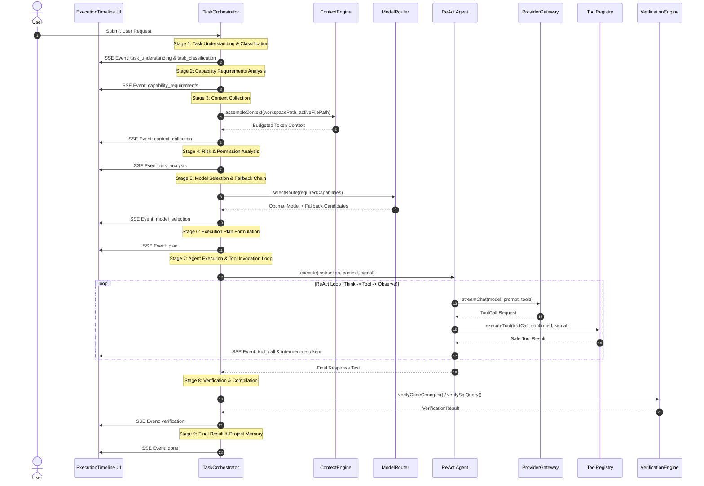
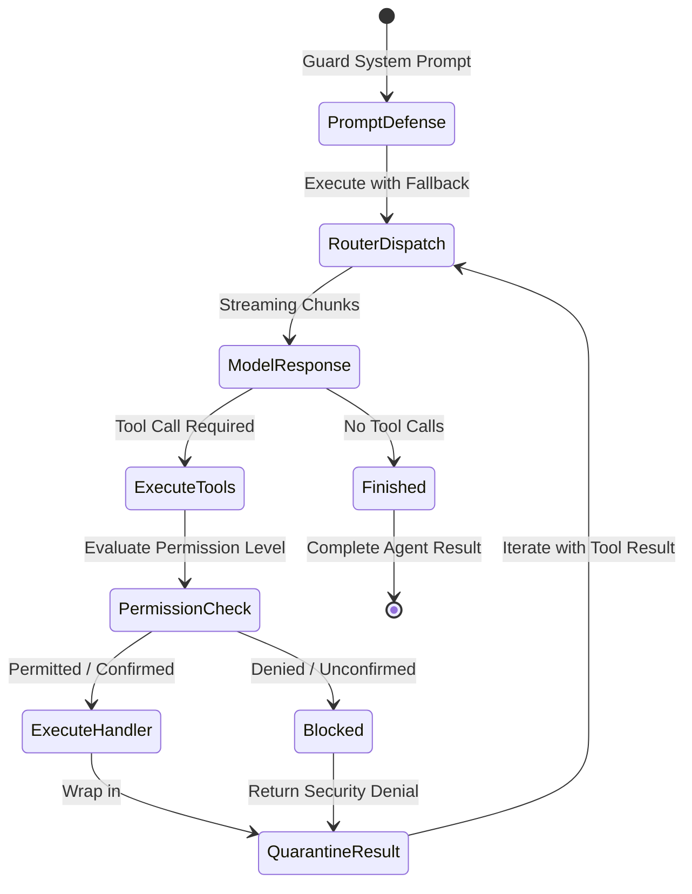
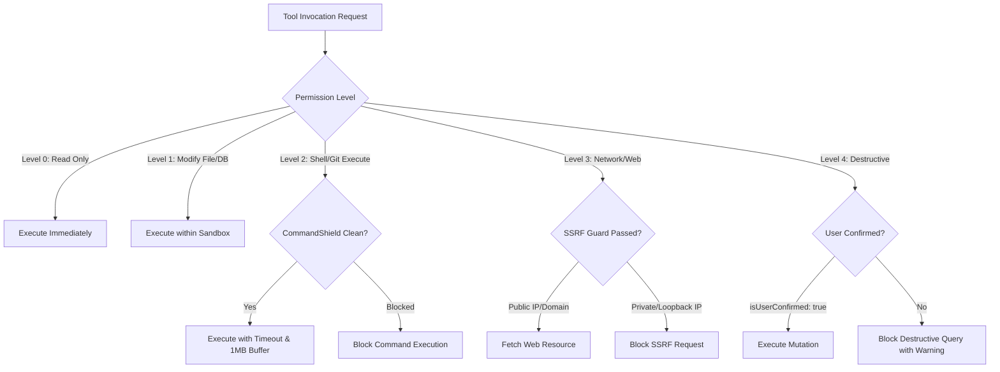
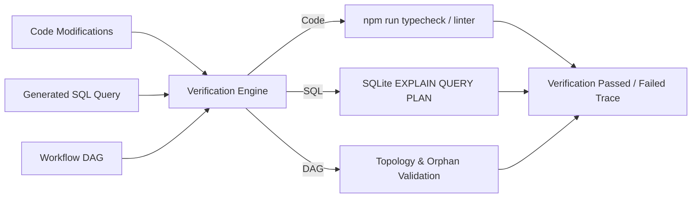

# OmniWorkspace Production Architecture

OmniWorkspace is a universal, model-agnostic AI workspace designed for software engineering, database administration, data analysis, deep research, automation workflows, and multimodal orchestration.

---

## 1. High-Level Application Architecture

```
+-----------------------------------------------------------------------------------+
|                           Electron 33 Desktop Shell                               |
|   (Context Isolation: ON | Node Integration: OFF | Sandbox: ON | Whitelist IPC)   |
+-----------------------------------------------------------------------------------+
                                         │
+-----------------------------------------------------------------------------------+
|                        OmniWorkspace Client (React 19)                            |
|                                                                                   |
|  [Header & Omnibar]  [Sidebar Perspectives]  [Active Workspace View]              |
|  * Chat Studio       * Code Studio          * Architecture Graph                  |
|  * SQL Console       * Data Studio          * Research Canvas                     |
|  * Automation DAG    * Document Studio      * Creative Media                      |
|  * Model Manager     * Settings & Security  * Bottom Panel (Terminal/Git/Output)  |
|                                                                                   |
|  [Execution Timeline & Observability Surface] (Category Filters, Search, STOP)    |
+-----------------------------------------------------------------------------------+
                                         │
                             HTTP REST & SSE Events
                                         │
+-----------------------------------------------------------------------------------+
|                           OmniWorkspace Server (Node.js)                          |
|                                                                                   |
|  ┌─────────────────────────────────────────────────────────────────────────────┐  |
|  │                         Universal Task Orchestrator                         │  |
|  │  Intent Classification ➔ Capability Analysis ➔ Centralized Context Engine   │  |
|  │  Risk & Permission Guard ➔ Extensible Model Router ➔ ReAct Agent Lifecycle  │  |
|  └─────────────────────────────────────────────────────────────────────────────┘  |
|                                         │                                         |
|         ┌───────────────────────────────┼───────────────────────────────┐         |
|         ▼                               ▼                               ▼         |
|  ┌───────────────┐             ┌─────────────────┐             ┌────────────────┐ |
|  | Model Router  |             | Tool Registry   |             | Verification   | |
|  | & Gateway     |             | & Security      |             | Engine         | |
|  |               |             |                 |             |                | |
|  | * OpenAI      |             | * File & Code   |             | * Typecheck    | |
|  | * NVIDIA NIM  |             | * Terminal/Git  |             | * EXPLAIN Plan | |
|  | * OpenRouter  |             | * Data & SQL    |             | * DAG Topology | |
|  | * Ollama      |             | * Web & Network |             | * Test Suite   | |
|  └───────────────┘             └─────────────────┘             └────────────────┘ |
|         │                               │                               │         |
|         ▼                               ▼                               ▼         |
|  ┌───────────────┐             ┌─────────────────┐             ┌────────────────┐ |
|  | Credential    |             | Security        |             | Persistence    | |
|  | Vault         |             | Defense Shields |             | Database       | |
|  |               |             |                 |             |                | |
|  | AES-256-GCM   |             | * PathShield    |             | node:sqlite    | |
|  | BYOK Storage  |             | * CommandShield |             | workspace.db   | |
|  | Zero Leakage  |             | * PromptDefense |             | WAL Journal    | |
|  └───────────────┘             └─────────────────┘             └────────────────┘ |
+-----------------------------------------------------------------------------------+
```

---

## 2. Universal AI Request Lifecycle (The Golden Pipeline)

Every natural language request follows the unified 9-stage golden execution pipeline:



---

## 3. Model Routing & Fallback Architecture

The model router dynamically scores all enabled models against task capability requirements:

```
Required Capabilities: [Coding, Reasoning, Tool Calling]
                     │
                     ▼
┌──────────────────────────────────────────────────────────┐
│              Capability Matching & Scoring               │
│                                                          │
│  Score = (MatchRatio * 40) + Priority + LocalPreference   │
│          + ContextWindowFit - LatencyPenalty             │
└──────────────────────────────────────────────────────────┘
                     │
        ┌────────────┴────────────┐
        ▼                         ▼
┌──────────────────┐     ┌──────────────────┐
│  Selected Model  │     │  Fallback Chain  │
│  Claude 3.5      │     │  1. Llama 3.1 70B│
│  Sonnet (Score 100)    │  2. Qwen 2.5 Coder│
└──────────────────┘     └──────────────────┘
        │                         ▲
        ▼                         │
┌──────────────────┐     429 / Timeout /
│  Provider Call   │──── Error Trigger
└──────────────────┘
```

---

## 4. ReAct Agent Execution Loop

Specialized agents (`coding`, `sql`, `data`, `research`, `automation`, `media`, `document`) inherit from `BaseAgent`:



---

## 5. Tool Execution & Security Defense Layers

```
Incoming Tool Invocation
           │
           ▼
┌──────────────────────────────────────────────────────────────┐
│  Layer 1: PermissionManager Check                            │
│  (LEVEL_0_READ_ONLY to LEVEL_4_ROOT / Destructive Gating)     │
└──────────────────────────────────────────────────────────────┘
           │ (Allowed)
           ▼
┌──────────────────────────────────────────────────────────────┐
│  Layer 2: Parameter & Path Validation                        │
│  * PathShield: Canonical path resolution, symlink containment │
│  * CommandShield: Regex detection of hazardous shell commands │
│  * SSRF Guard: Blocks localhost, link-local, RFC 1918 IPs    │
└──────────────────────────────────────────────────────────────┘
           │ (Sanitized)
           ▼
┌──────────────────────────────────────────────────────────────┐
│  Layer 3: Execution with AbortSignal Monitoring              │
│  * Terminal child processes killed with SIGTERM on abort     │
│  * Database queries capped and audited                       │
│  * Audit log recorded in WorkspaceDatabase                   │
└──────────────────────────────────────────────────────────────┘
```

---

## 6. Permission Flow & Destructive Confirmation



---

## 7. Context Engine Flow

```
Current Execution State
  ├─ Workspace Active File Path
  ├─ User Pinned Symbols
  ├─ Git Branch & Status
  └─ Recent Terminal Logs
           │
           ▼
┌──────────────────────────────────────────────────────────────┐
│                 Token Budgeting & Filtering                  │
│                                                              │
│  1. Pinned Items (Highest Priority)                          │
│  2. Active File Content (Sanitized via PathShield, max 16k)  │
│  3. Git Branch & Working Tree Summary                        │
│  4. Recent Terminal Output (tail 3000 chars)                 │
│  5. Hard Token Budget Cutoff (8,000 token limit)             │
└──────────────────────────────────────────────────────────────┘
           │
           ▼
Aggregated Context Block wrapped with <workspace_context>
```

---

## 8. Verification Pipeline



---

## 9. Multi-Provider Gateway Abstraction

The provider gateway normalizes heterogeneous LLM and local inference engines into a unified API surface:

```
               ┌───────────────────────┐
               │    ProviderGateway    │
               └───────────┬───────────┘
                           │
       ┌───────────────────┼───────────────────┐
       ▼                   ▼                   ▼
┌──────────────┐    ┌──────────────┐    ┌──────────────┐
│    NVIDIA    │    │  OpenRouter  │    │    Ollama    │
│  Hosted NIM  │    │ Gateway API  │    │ Local Daemon │
└──────┬───────┘    └──────┬───────┘    └──────┬───────┘
       │                   │                   │
       └───────────────────┼───────────────────┘
                           │
                           ▼
              ┌─────────────────────────┐
              │    Error Normalizer     │
              │                         │
              │ * AUTHENTICATION_FAILED │
              │ * RATE_LIMIT_EXCEEDED   │
              │ * MODEL_NOT_FOUND       │
              │ * TIMEOUT / CANCELLED   │
              │ * Secret Token Scrubbed │
              └─────────────────────────┘
```

---

## 10. Plugin Architecture & Permission Boundaries

Third-party extensions located in `.omni-data/plugins` or `plugins/` declare an explicit permission scope:

```json
{
  "id": "community-extension",
  "name": "Community Analytics Extension",
  "version": "1.0.0",
  "permissions": {
    "readWorkspace": true,
    "writeWorkspace": false,
    "network": true,
    "terminal": false,
    "database": false,
    "credentials": false
  },
  "isApproved": false
}
```

* **Standard Plugins**: Tools requiring only `readWorkspace` load automatically.
* **Elevated Plugins**: Tools requiring `terminal`, `database`, `writeWorkspace`, or `credentials` are isolated in `pendingApprovalPlugins` until the user explicitly approves elevated privileges.

---

## 11. Electron Desktop Security Boundary

```
┌──────────────────────────────────────────────────────────────┐
│                    BrowserWindow (Renderer)                  │
│                                                              │
│  * Context Isolation: TRUE                                   │
│  * Node Integration: FALSE                                   │
│  * Sandbox: TRUE                                             │
│  * Window Open: Denied / Forwarded to shell.openExternal     │
└──────────────────────────────┬───────────────────────────────┘
                               │
               contextBridge (Whitelisted IPC)
                               │
┌──────────────────────────────▼───────────────────────────────┐
│                     Electron Main Process                    │
│                                                              │
│  * Spawns localized background Node.js server                │
│  * Manages native application window & menus                 │
│  * Zero arbitrary shell execution from renderer IPC          │
└──────────────────────────────────────────────────────────────┘
```

---

## 12. Durable Data Persistence Architecture

The local database engine uses Node.js built-in `node:sqlite` for zero external native dependency compilation errors:

```
.omni-data/workspace.db
  ├─ conversations (id, title, created_at, updated_at)
  ├─ messages (id, conversation_id, role, content, metadata, created_at)
  ├─ workflows (id, name, nodes, edges, updated_at)
  ├─ workflow_runs (id, workflow_id, is_dry_run, success, step_logs, final_output)
  ├─ providers (id, name, type, base_url, enabled)
  ├─ models (id, name, provider_id, capabilities, priority, enabled)
  ├─ audit_logs (id, timestamp, tool_name, permission_level, status, duration_ms)
  └─ execution_traces (task_id, steps, verification_status, timestamps)
```
